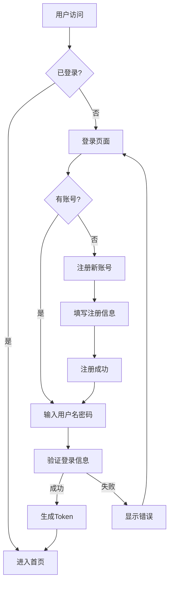
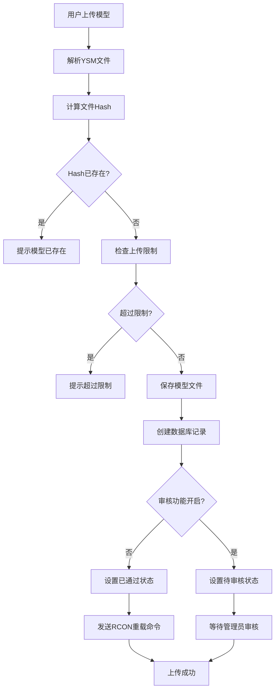
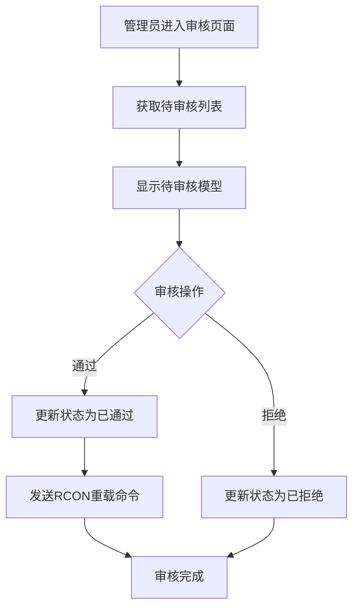
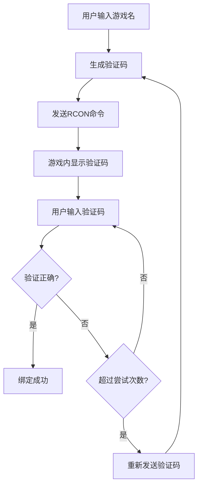
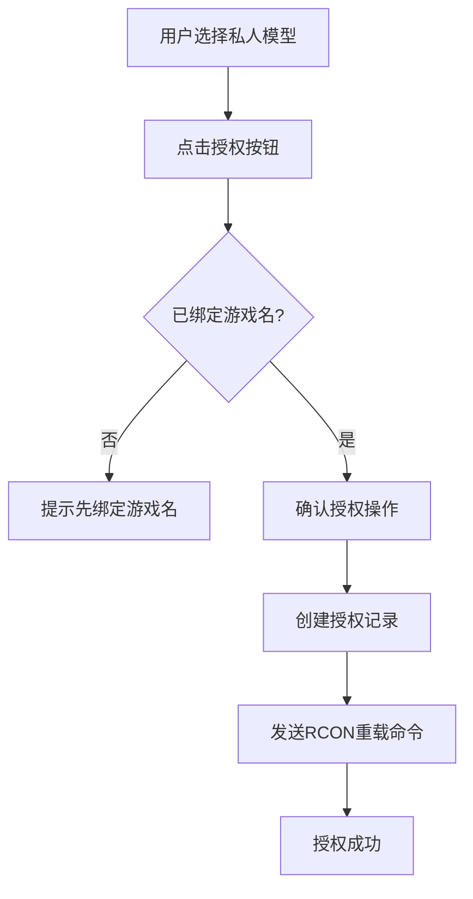
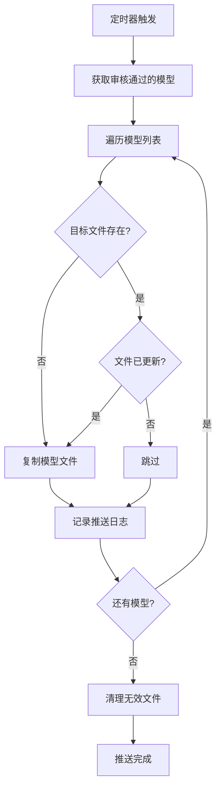

# YSM Hub

一个用于管理 Yes Steve Model (YSM) 模型的 Web 平台，支持模型上传、审核、授权和 RCON 远程管理。

## 功能特性

- **模型管理** - 上传、编辑、删除 YSM 模型文件
- **模型中心** - 公开模型浏览、评分、评论系统
- **审核系统** - 管理员审核上传的模型，可开启/关闭审核功能
- **用户管理** - 用户注册、登录、权限管理
- **游戏绑定** - 通过 RCON 发送验证码绑定游戏名
- **模型授权** - 将私人模型授权给绑定的游戏名
- **定时推送** - 自动将审核通过的模型推送到游戏服务器
- **RCON 控制台** - 远程执行 Minecraft 服务器命令
- **数据统计** - 用户数、模型数、授权数统计
- **头像上传** - 支持头像裁剪上传

## 技术栈

- **前端**: Vue 3 + Vite + Pinia
- **后端**: Node.js + Express
- **数据库**: SQLite (Prisma ORM)
- **文件存储**: 本地文件系统

## 快速开始

### 环境要求

- Node.js >= 18
- npm >= 9

### 安装

```bash
# 克隆仓库
git clone https://github.com/LingMowen/YSM-Hub.git
cd YSM-Hub

# 安装依赖
npm install
cd client && npm install && cd ..

# 初始化数据库
npx prisma generate
npx prisma db push

# 构建前端
cd client && npm run build && cd ..
```

### 配置

复制 `.env.example` 为 `.env` 并修改配置：

```env
# 服务器配置
PORT=8181
HOST=0.0.0.0

# 数据库
DATABASE_URL="file:./data.db"

# JWT 密钥
JWT_SECRET=your-secret-key

# 管理员配置
ADMIN_NAME=admin
ADMIN_PASSWORD=admin123

# RCON 配置
RCON_HOST=localhost
RCON_PORT=25575
RCON_PASSWORD=your-rcon-password

# 模型存储路径 (需与游戏服务器共享)
YSM_MODEL_DIR=./ysm_models

# 邮件配置 (可选)
SMTP_HOST=
SMTP_PORT=
SMTP_USER=
SMTP_PASS=
```

### 启动

```bash
node app.js
```

访问 `http://localhost:8181` 即可使用。

默认管理员账号：
- 用户名: `admin`
- 密码: `admin123`

## 流程图

### 用户注册/登录流程



### 模型上传流程



### 模型审核流程



### 游戏名绑定流程



### 模型授权流程



### 定时推送流程



## 与游戏服务器集成

### 方式一：共享目录

1. 将 `YSM_MODEL_DIR` 设置为游戏服务器的 `mods/yes_steve_model` 目录
2. 配置 RCON 连接信息
3. 上传模型后系统会自动发送 `ysm model reload` 命令重载模型

### 方式二：定时推送

1. 在管理后台设置"游戏服务器模型目录"
2. 设置推送间隔时间
3. 开启"启用定时推送"
4. 系统会自动将审核通过的模型推送到游戏服务器

## 目录结构

```
ysm-manager-server/
├── app/                 # 后端应用
│   ├── Controller/      # 控制器
│   └── Middleware/      # 中间件
├── client/              # 前端应用
│   └── src/
│       ├── views/       # 页面组件
│       ├── components/  # 通用组件
│       ├── stores/      # Pinia 状态
│       └── api/         # API 接口
├── prisma/              # 数据库模型
├── routes/              # 路由定义
├── src/                 # 工具函数
├── uploads/             # 上传文件存储
└── ysm_models/          # 模型文件存储
    └── {hash}/          # 以模型哈希值为文件夹名
        ├── {name}.ysm   # 模型文件
        ├── preview.png  # 预览图
        └── info.json    # 模型信息
```

## 更新日志

### v1.0.0 (2026-04-04)

**新增功能**
- 模型上传、编辑、删除功能
- 模型中心公开浏览、评分、评论系统
- 管理员审核系统（可开关）
- 用户注册、登录、权限管理
- 游戏名绑定（RCON验证码验证）
- 私人模型授权功能
- 定时推送模型到游戏服务器
- RCON 控制台
- 数据统计面板
- 头像上传（支持裁剪）
- 模型预览图上传

**模型存储结构**
- 以模型哈希值为文件夹名存储
- 包含模型文件、预览图、详情信息

**删除逻辑**
- 管理员删除：删除项目文件夹 + 游戏服务器模型文件 + 数据库记录
- 普通用户删除：只删除数据库记录，游戏服务器文件在下次推送时清理

**技术改进**
- 替换原生 alert/confirm 为自定义弹窗
- 优化操作后数据刷新逻辑
- 添加 Apache License 2.0 许可证

## 致谢

本项目基于 [ysm-manager-server](https://github.com/XiaoDengPiaoPiao/ysm-manager-server) 开发，感谢原作者的工作。

## License

Apache License 2.0
